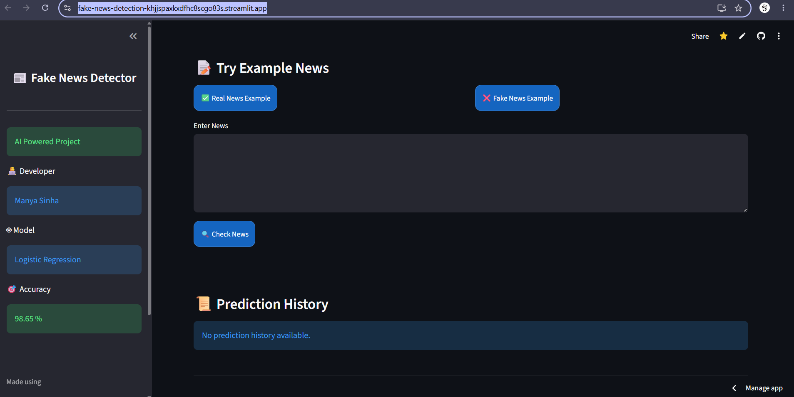

# Fake News Detection using Machine Learning

## Overview
Fake News Detection is a Machine Learning based project that classifies news articles as **Fake or Real** using Natural Language Processing (NLP) techniques.

The model uses **TF-IDF Vectorization** for text feature extraction and **Logistic Regression** as a classifier to predict the authenticity of news articles.

## Live Demo
https://fake-news-detection-khjjspaxkxdfhc8scgo83s.streamlit.app/

## Screenshot

## Features
- Fake and Real news classification
- NLP based text processing
- TF-IDF Vectorization for feature extraction
- Logistic Regression Machine Learning model
- Interactive Streamlit Web Application
- Trained on ISOT Fake News Dataset

## Technologies Used
- Python
- Pandas
- Scikit-learn
- TF-IDF Vectorizer
- Logistic Regression
- Streamlit
- Joblib

## Machine Learning Workflow
1. Data Collection
2. Data Cleaning and Preprocessing
3. Text Feature Extraction using TF-IDF
4. Model Training using Logistic Regression
5. Model Evaluation
6. Deployment using Streamlit

## Dataset
ISOT Fake News Dataset

## Project Structure
Fake-News-Detection/ │── data/ │── train.py │── webapp.py │── requirements.txt │── model.pkl │── vectorizer.pkl │── README.md
## How to Run Locally

Install dependencies:
pip install -r requirements.txt

Train the model:
python train.py

Run the application:
streamlit run webapp.py

## Model Information
- Algorithm Used: Logistic Regression
- Feature Extraction Technique: TF-IDF Vectorization

## Author

**Manya Sinha**
